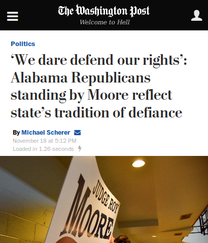

# 🤘Metal Washington Post🤘
A browser extension to replace
[The Washington Post](https://washingtonpost.com)'s
"Democracy Dies in Darkness" masthead with random metal albums. Inspired by [the Slate's photoshop version](http://www.slate.com/blogs/the_slatest/2017/02/22/_15_classic_metal_albums_whose_titles_are_less_dark_than_the_washington.html).

