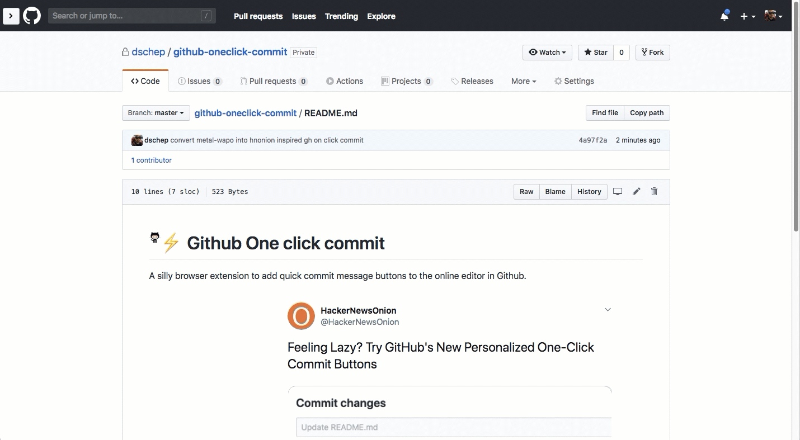

# Github One click commit
A silly browser extension to add quick commit message buttons to the online editor in Github.

### Demo

Inspired by [@HackerNewsOnion](https://twitter.com/HackerNewsOnion/status/1109115876161273856)

### not real links yet

